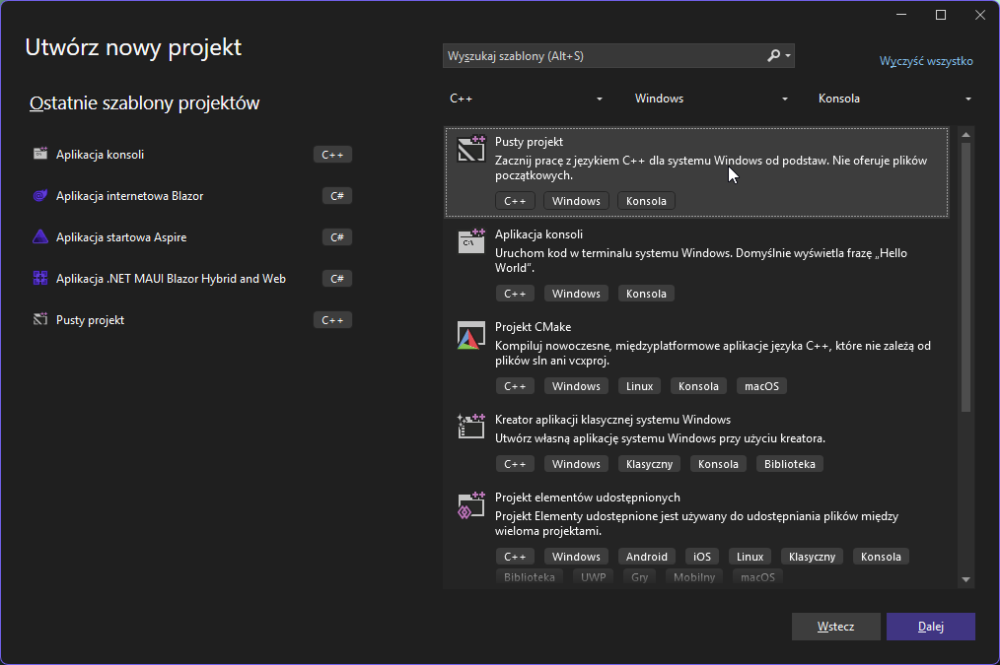
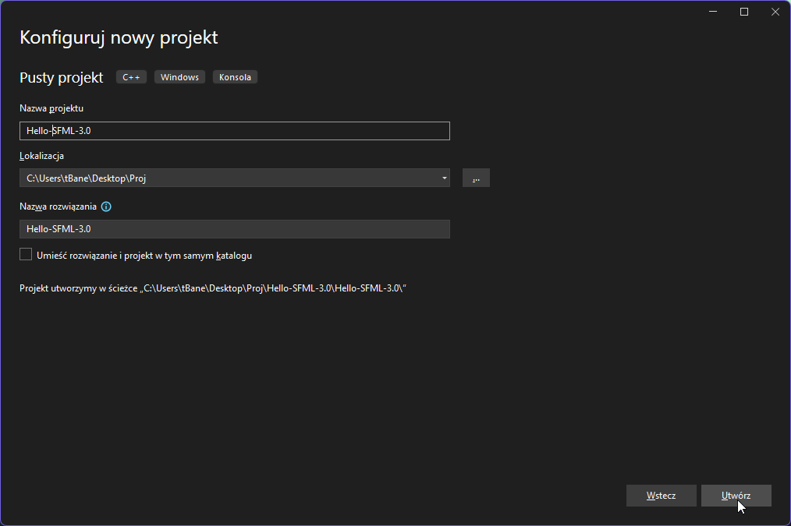
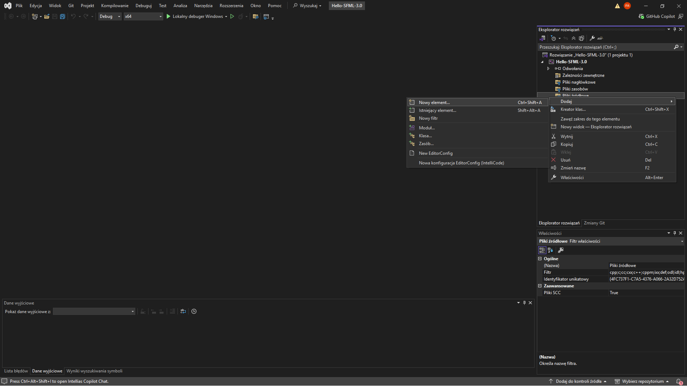
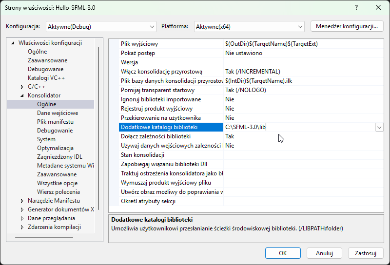
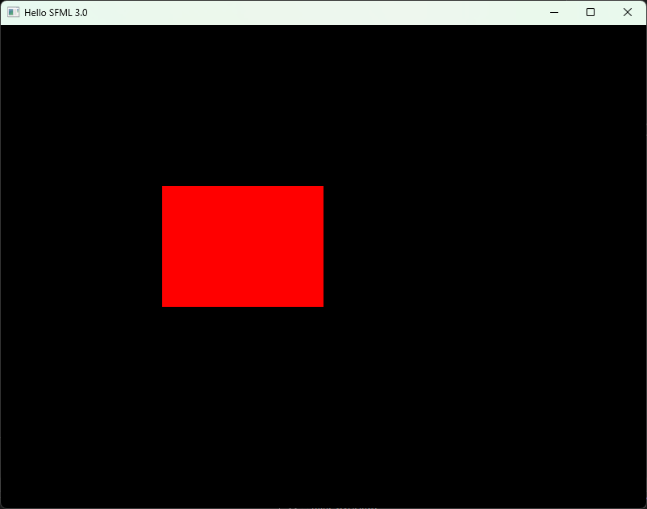

# Konfiguracja 

Po pobraniu i rozpakowaniu biblioteki SFML 3.0 należy skonfigurować projekt w środowisku Visual Studio 2022.

W tym celu utwórz nowy projekt typu ``Pusty Project`` i dodaj do niego pusty plik ``main.cpp``.






Do pliku main.cpp wklejamy poniższy kod. Spróbuj go skompilować. Jeżeli działa, to znaczy, że wszystko zrobiłeś dobrze.
```cpp
#include <iostream>

int main() {
    std::cout << "Hello World!" << std::endl;
    return 0;
}
```

Następnie należy otworzyć jego właściwości, klikając prawym przyciskiem myszy na nazwę projektu w Eksploratorze rozwiązań i wybierając opcję ``Właściwości``.

## Konfiguracja projektu składa się z czterech kroków:
```
-Ustawienie standardu języka C++
-Dodanie katalogu z plikami nagłówkowymi SFML.
-Dodanie katalogu z bibliotekami SFML.
-Dodanie bibliotek wymaganych podczas linkowania programu.
```

## Ustawienie standardu języka C++

SFML 3.0 wymaga kompilacji w nowoczesnym standardzie C++.
Dlatego należy przejść do:
``C/C++ -> Język -> Standard języka C++``

I ustawić:
``ISO C++17 Standard (/std:c++17)``

lub nowszy, na przykład:
``ISO C++20 Standard (/std:c++20)``

## Dodanie katalogu z plikami nagłówkowymi SFML.

W pierwszej kolejności należy wskazać kompilatorowi lokalizację plików nagłówkowych biblioteki SFML.
Otwórz właściwości projektu i przejdź do:
``C/C++ -> Ogólne -> Dodatkowe katalogi plików nagłówkowych``

Następnie wpisz ścieżkę do katalogu ``include`` znajdującego się w rozpakowanej bibliotece SFML.
Przykład:
``C:\SFML-3.0\include``


Po zatwierdzeniu zmian Visual Studio będzie mogło odnaleźć wszystkie pliki nagłówkowe SFML, takie jak:
```
#include <SFML/Graphics.hpp>
#include <SFML/Window.hpp>
#include <SFML/System.hpp>
```

## Dodanie katalogu z bibliotekami SFML.
Następnie należy wskazać linkerowi lokalizację plików biblioteki SFML.
Przejdź do:
``Konsolidator -> Ogólne -> Dodatkowe katalogi bibliotek``
Następnie wpisz ścieżkę do katalogu lib:
``C:\SFML-3.0\lib``



## Dodanie bibliotek wymaganych podczas linkowania programu.
Ostatnim krokiem jest dodanie bibliotek SFML, które będą linkowane z programem.
Przejdź do:
``Konsolidator -> Dane wejściowe -> Dodatkowe zależności``

Dopisz następujące biblioteki:
```
sfml-graphics.lib
sfml-window.lib
sfml-system.lib
```

Biblioteki należy wpisać w osobnych liniach lub oddzielić średnikiem.
W przypadku konfiguracji Debug można użyć wersji z końcówką -d:
```
sfml-graphics-d.lib
sfml-window-d.lib
sfml-system-d.lib
```


Dla konfiguracji Release należy używać bibliotek bez końcówki -d.


## Kopiowanie plików DLL
Po skonfigurowaniu projektu należy jeszcze skopiować pliki DLL biblioteki SFML do katalogu, w którym uruchamiany jest program.
Pliki DLL znajdują się w katalogu:
``C:\SFML-3.0\bin``

Dla konfiguracji Debug skopiuj:
```
sfml-graphics-d-3.dll
sfml-window-d-3.dll
sfml-system-d-3.dll
```

Dla konfiguracji Release skopiuj:
```
sfml-graphics-3.dll
sfml-window-3.dll
sfml-system-3.dll
```

Pliki DLL należy wkleić do katalogu z plikiem wykonywalnym programu, na przykład: ``x64\Debug`` albo ``x64\Release``

## Pierwszy program
Wreszcie możemy uruchomić pierwszy program. Program ten tworzy okno o rozmiarze 800x600 pikseli oraz rysuje czerwony prostokąt o rozmiarze 200x150 pikseli. Prostokąt jest umieszczony w pozycji (200, 200), licząc od lewego górnego rogu okna.

Zwróć uwagę, że obiekt sf::RectangleShape jest tworzony tylko raz przed pętlą główną programu. Wielu początkujących programistów tworzy obiekty wewnątrz pętli while, przez co są one niepotrzebnie tworzone od nowa w każdej klatce.

Program składa się z dwóch głównych części:
-inicjalizacji okna oraz obiektów, <br>
-pętli głównej programu, która obsługuje zdarzenia i renderuje grafikę.

```cpp
#include <SFML/Graphics.hpp>

int main() {
    // create the Window
    sf::RenderWindow window = sf::RenderWindow( sf::VideoMode( sf::Vector2u( 800u, 600u ) ), "Hello SFML 3.0" );
   
    // create the rectangle
    sf::RectangleShape rect( sf::Vector2f( 200.f, 150.f ) ); // create the rectangle shape with size 200x150
    rect.setFillColor( sf::Color::Red ); // set the fill color of the rectangle to red
    rect.setPosition( sf::Vector2f( 200.f, 200.f ) ); // set the position of the rectangle to (200, 200)
   
    while( window.isOpen() ) {
       
        window.clear( sf::Color::Black ); // clear screen with black color
        window.draw( rect ); // draw rectangle
        window.display(); // display the rendered frame on screen
    }
}
```
