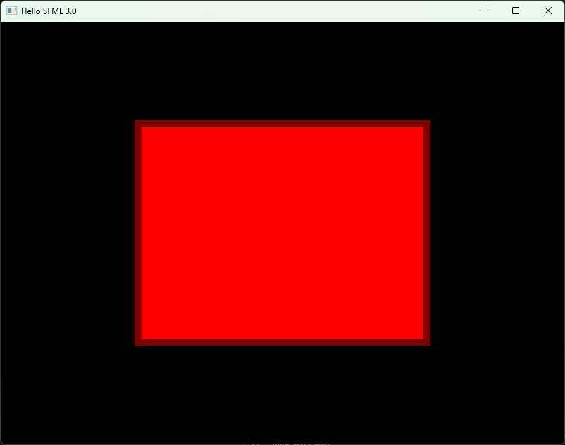
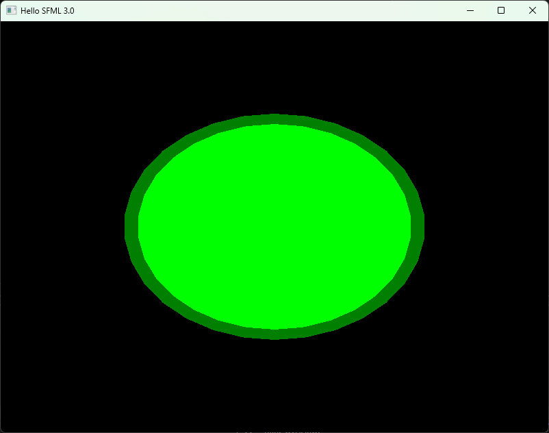

# Prymitywy

SFML oferuje kilka podstawowych kształtów, które można renderować na ekranie. Są to między innymi prostokąty, koła oraz kształty nieregularne.

W tej części poradnika poznamy sposób tworzenia i rysowania tych obiektów.

## Prostokąt (sf::RectangleShape)

Pierwszym kształtem jest prostokąt reprezentowany przez klasę sf::RectangleShape.

Poniższy program tworzy prostokąt o rozmiarze 400x300 pikseli w pozycji 200x150. Wypełnienie prostokąta ma kolor czerwony, natomiast obrys ma kolor ciemnoczerwony i grubość 10 pikseli.

Zwróć uwagę na zapis ``sf::Color( 127, 0, 0 )``

W tym przypadku kolor jest tworzony poprzez podanie kolejno składowych:

```
-Red (czerwony)
-Green (zielony)
-Blue (niebieski)
```

Każda wartość może przyjmować zakres od 0 do 255.

Możliwe jest również podanie czwartego parametru określającego przezroczystość (Alpha), jednak na razie nie będziemy z niego korzystać.


```cpp

#include <SFML/Graphics.hpp>

int main() {
    sf::RenderWindow window = sf::RenderWindow( sf::VideoMode( sf::Vector2u( 800u, 600u ) ), "Hello SFML 3.0" );
   
    sf::RectangleShape rect( sf::Vector2f( 400.f, 300.f ) ); // create the rectangle shape with size 400x300
    rect.setFillColor( sf::Color::Red ); // set the fill color of the rectangle to red
    rect.setOutlineThickness( 10.0f ); // set the outline thickness of the rectangle to 10 pixels
    rect.setOutlineColor( sf::Color( 127, 0, 0 ) ); // set the outline color of the rectangle to dark red
    rect.setPosition( sf::Vector2f( 200.f, 150.f ) ); // set the position of the rectangle to (200, 150)
   
    while( window.isOpen() ) {
       
        window.clear( sf::Color::Black ); // clear screen with black color
        window.draw( rect ); // draw rectangle
        window.display(); // display the rendered frame on screen
    }
}

```




## Okrąg (sf::CircleShape)

Klasa sf::CircleShape służy do rysowania okręgów i kół. Jako parametr konstruktora przyjmuje promień okręgu. W naszym przykładzie promień wynosi 100 pikseli.

Okrąg jest wypełniony kolorem zielonym oraz posiada ciemnozielony obrys o grubości 10 pikseli.
Dodatkowo użyliśmy funkcji setScale, która skaluje obiekt dwukrotnie w poziomie oraz 1,5 raza w pionie. Funkcja ta działa dla wszystkich klas dziedziczących po sf::Transformable, między innymi dla prostokątów, okręgów i sprite'ów.
W przykładzie została również użyta funkcja setOrigin. Domyślnie punkt odniesienia każdego kształtu znajduje się w jego lewym górnym rogu. Dla okręgu o promieniu 100 pikseli środek znajduje się w punkcie (100, 100), dlatego ustawiamy punkt odniesienia właśnie na tę pozycję.
Dzięki temu wszystkie transformacje, takie jak pozycjonowanie, obrót czy skalowanie, będą wykonywane względem środka okręgu.
Na końcu ustawiamy pozycję kształtu na (400, 300), czyli dokładnie w środku okna o rozmiarze 800x600 pikseli.

Warto zwrócić uwagę, że po zastosowaniu skali (2.0, 1.5) kształt przestaje być idealnym okręgiem i staje się elipsą.

```cpp
#include <SFML/Graphics.hpp>

int main() {
    sf::RenderWindow window = sf::RenderWindow( sf::VideoMode( sf::Vector2u( 800u, 600u ) ), "Hello SFML 3.0" );
   
    sf::CircleShape circle( 100.f ); // create a circle shape with radius 100
    circle.setFillColor( sf::Color::Green ); // set the fill color of the circle to green
    circle.setOutlineThickness( 10.0f ); // set the outline thickness of the circle to 10 pixels
    circle.setOutlineColor( sf::Color( 0, 127, 0 ) ); // set the outline color of the circle to dark green
    circle.setOrigin( sf::Vector2f( 100.f, 100.f ) ); // set the origin of the circle to its center (100, 100)
    circle.setScale( sf::Vector2f( 2.f, 1.5f ) ); // set the scale of the circle to 2 in x direction and 1.5 in y direction
    circle.setPosition( sf::Vector2f( 400.f, 300.f ) ); // set the position of the circle to (400, 300) so center of screen
   
    while( window.isOpen() ) {
       
        window.clear( sf::Color::Black ); // clear screen with black color
        window.draw( circle ); // draw circle
        window.display(); // display the rendered frame on screen
    }
}
```




